Overview of graphical user interface
####################################

Qt version
**********

1. Main screen
==============

.. figure:: images/manual_main_screen.png
   :scale: 50 %
   :alt: main_screen

2. Sample tree
==============

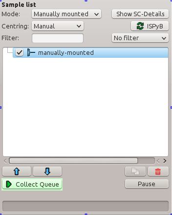

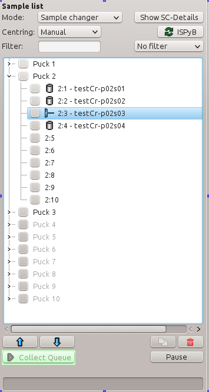

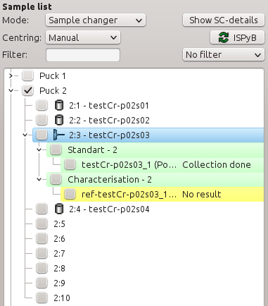

+------------------+--------------------------+-----------------+
| Manually mounted | Sample changer and ISPyB | Queue execution |
+------------------+--------------------------+-----------------+
| |mount_manual|   | |moun_sc|                | |queue_exec|    |
+------------------+--------------------------+-----------------+

3. Graphical objects and tools
==============================

3.1. Basic shapes
-----------------

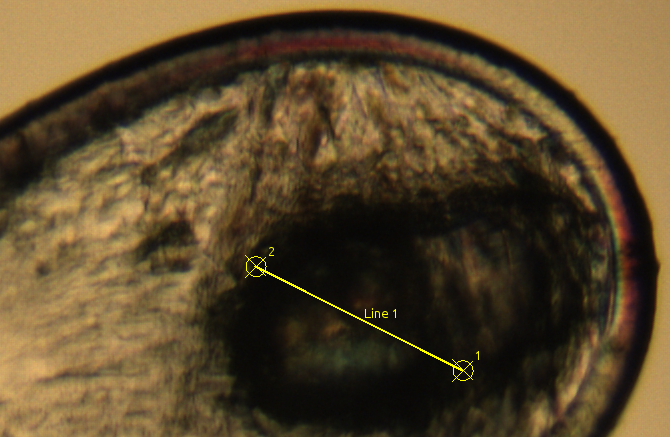

+------------------+----------------+----------------+
| Centring point   | Helical line   | Mesh           |
+------------------+----------------+----------------+
| |graphic_points| | |graphic_line| | |graphic_mesh| |
+------------------+----------------+----------------+

3.2. Measurement tools
----------------------

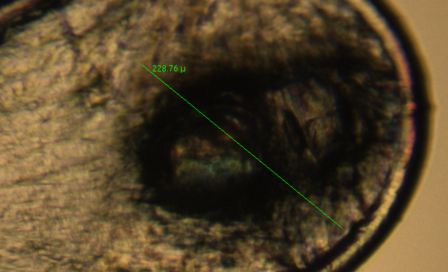

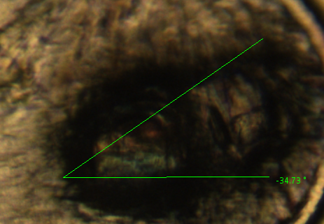

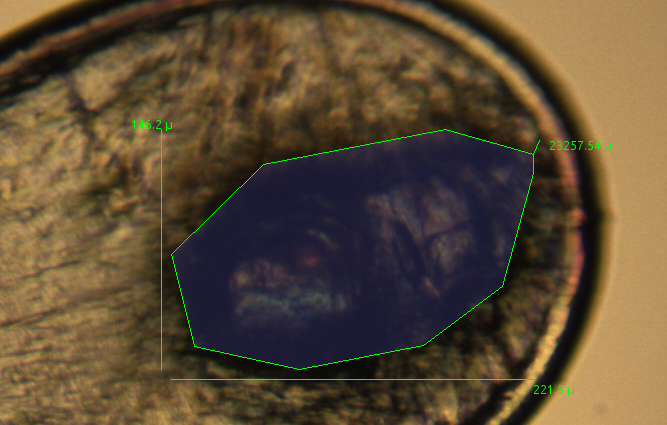

+--------------------+-----------------+----------------+
| Distance measure   | Angle measure   | Area measure   |
+--------------------+-----------------+----------------+
| |graphic_distance| | |graphic_angle| | |graphic_area| |
+--------------------+-----------------+----------------+

3.3. Other tools
----------------

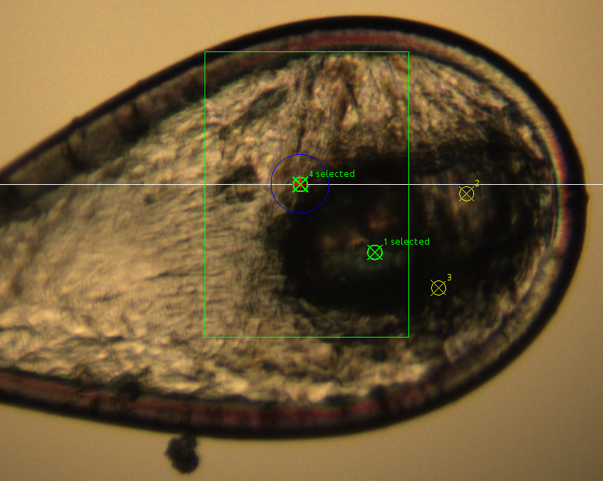

+------------------+---------------------+---------------------+
| Item selection   | Move beam mark      | Define beam size    |
+------------------+---------------------+---------------------+
| |graphic_select| | |graphic_move_beam| | |graphic_beam_size| |
+------------------+---------------------+---------------------+

4. Collection methods
=====================

4.1. Standart collection
------------------------

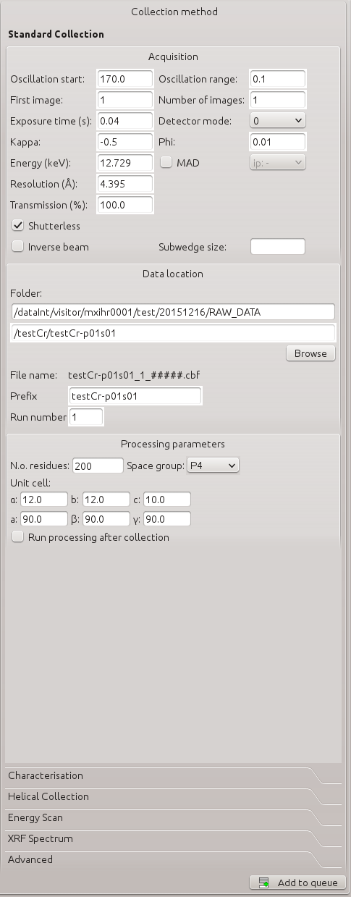

4.2. Characterisation
---------------------

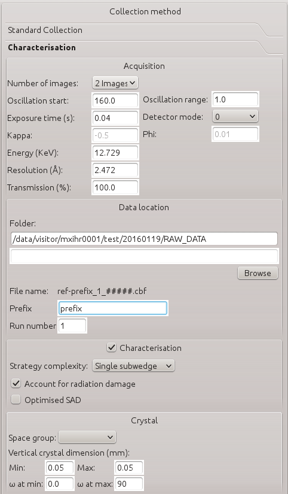

4.3. Helical collection
-----------------------

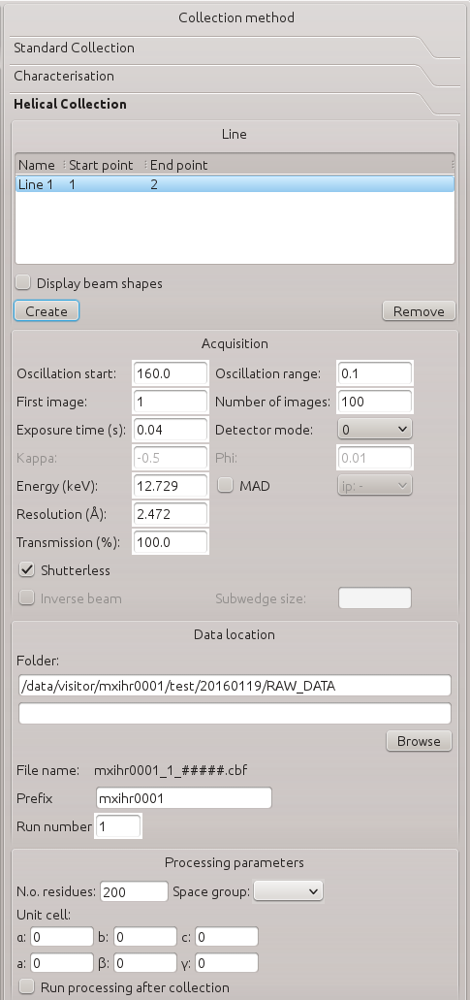

4.4. Advanced collection
------------------------

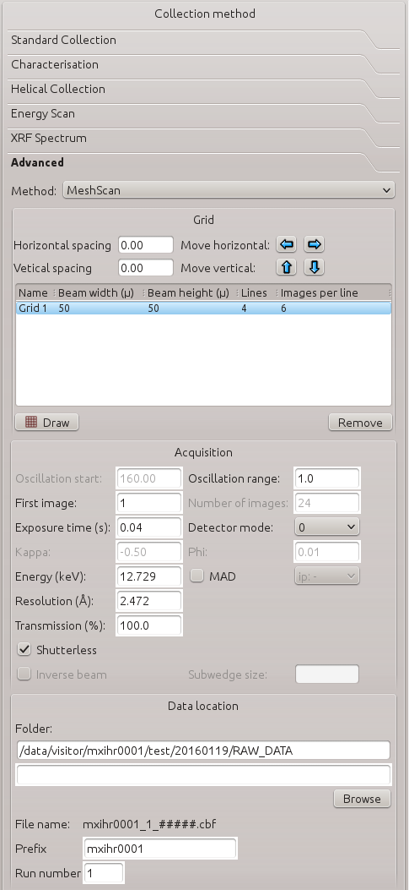

4.5. Energy scan
----------------

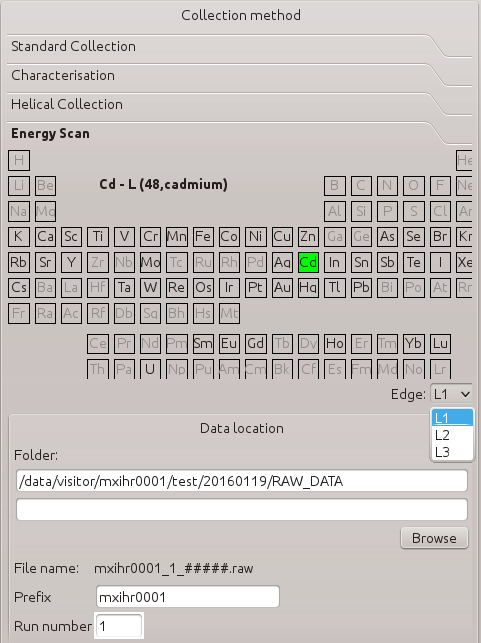

4.6. Fluorescence spectrum
--------------------------

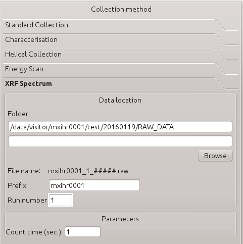

Web version
***********
