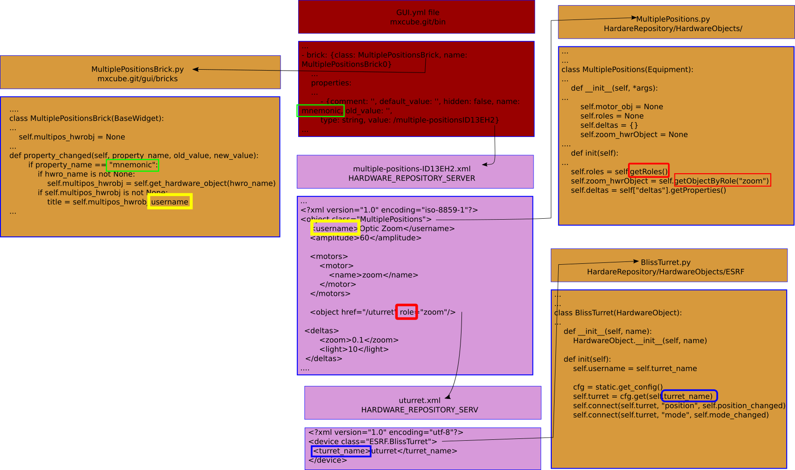
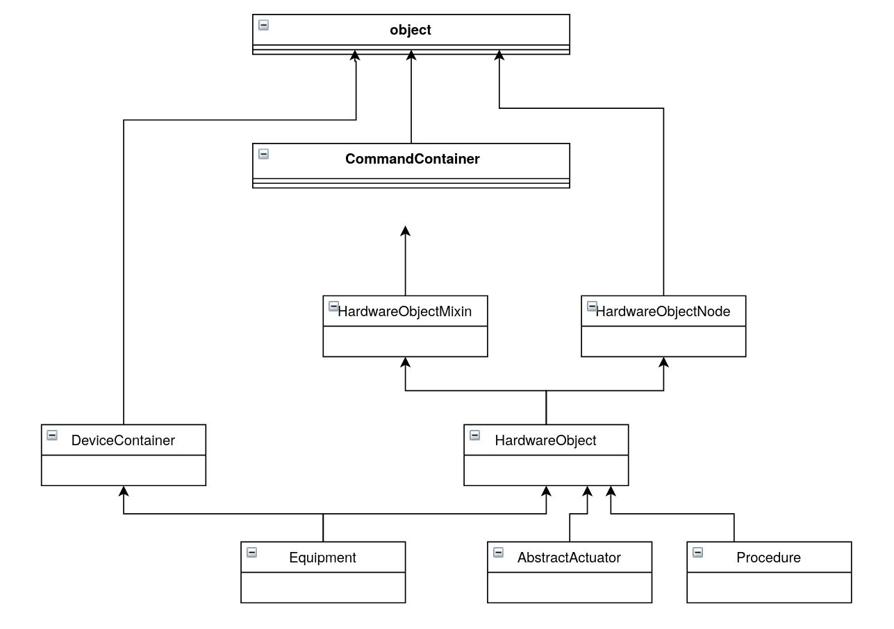
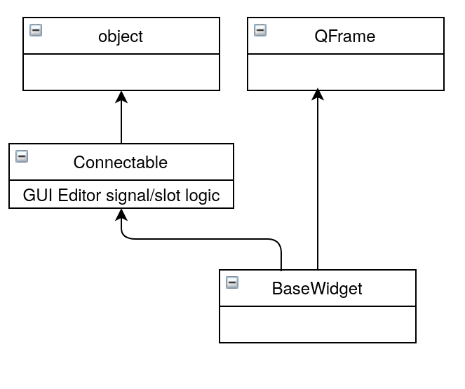

# MXCuBE Architecture

## MXCuBE introduction

MXCuBE application is in fact 2 things :

    * a beamline GUI designer tool (editor)
    * a set of Python modules, providing services dedicated to beamline GUI elements (aka "bricks") design,interaction and integration

This MXCuBE Framework is used to design and execute graphic user interfaces for beamline applications.
In order to achieve this, different types of files take part on the process:

* GUI files:
    * Files created when MXCuBE is executed in editor mode.
    * Different extensions types are allowed (`.gui`, `.yml`, `.json` ): the first one is not recommended, as it is not read-friendly and complicated to edit through a text editor.
    * This files describe the bricks that take part of the GUI, their layout and position on the application, the connections between them and their properties (like for example, the hardware object they are binded to)
    * By default, created in the `mxcube.git/bin` folder

* Brick .py code files:
    * Describe the layout and behaviour of the brick, including its interaction with an eventual hardware object
    * They can be linked to a `<brick_design>.ui` file, created with QtCreator tool: a fast, easy and visual way to set brick's components and layout. Stored in `mxcube.git/gui/ui_files`.
    * Stored in `mxcube.git/gui/bricks` folder  (subfolders admitted).
    
* Hardware Object .py code files:
    * Hardware objects define interface to actual beamline components.
    * They instantiate the Hardware Object with the help of the configuration file (see below)
    * Stored in `mxcube.git/HardwareRepository/HardwareObjects/` folder (subfolders admitted).

* XML files:
    * Files that are used to configure the hardware object
    * Stored in `mxcube.git/HardwareRepository/configuration/<beamline_line>` folder (subfolders admitted).


## MXCuBE in action

Here's an example to describe the logic behind the application and the relationship between the different type of files : GUI files, configuration xml files and brick and hardware object python code files.

Here we have an application created with framework's editor, with resulting of a GUI.yml file.
Looking inside this file we can see that the application includes a `MultiplePositionBrick`. This brick has a property called `mnemonic`, which is by default used to set the xml file that describes a hardware object.
This xml file is `multiple-positionsID13EH2.xml`. Inside this file we can see that the hardware object's class is `MultiplePositions`, certain values given to its properties (`username`, `amplitude`...), and that it has 'nested' hardware objects, defined with `role`.

Please note the squares of different colors that highlight the links between the different file sections' and source code.




### Parsing the beamline_config.yml file

The application launches and as first step, it parses the HARDWARE_REPOSITORY_SERVER (env variable, can be defined as an argument when executing application) folder looking for a file `named beamline_config.yml` file and creating and initializing the hardware objects described in it.
This file is basically a list of pairs "device: device_description_xml_file_name".
`beamline_config.yml` serves to create an object - beamline, accesible through the HardwareRepository module - that includes the whole definition of a beamline, including all its components.
The goal is to make available these beamline components to any hardware object or any brick in order to interact with it.

Here's an example of `beamline_config.yml` with three component on it:
- beam : hardware object linked to the beam (size, position, changes...)
- sample_view : hardware object to interact with microscope's/camera's images (create graphic items, measure sizes, highlight regions, move beam mark...)
- diffractometer : hardware object used to control the motors on top of which the sample is set.


Then, from any python file interaction with the hardware objects defined in the beamline_config.yml file is allowed.

Example, for the `ESRFCenteringBrick.py`

```
...
from HardwareRepository import HardwareRepository as HWR
...
class ESRFCenteringBrick(BaseWidget):
    def __init__(self, *args):
    ...
        self.connect(HWR.beamline.sample_view, "centringStarted", self.centring_started)
        self.connect(HWR.beamline.sample_view, "centringFailed", self.centring_failed)
        self.connect(HWR.beamline.diffractometer, "centring_image_clicked", self.image_clicked)
        self.connect(HWR.beamline.diffractometer, "centring_calculation_ended", self.show_centring_paremeters)

```

This HWR.beamline object is a singleton:

`""" Beamline class serving as singleton container for links to top-level HardwareObjects """`


Please notice the warnings on the comments on the beamline configuration file concerning the order of creation/loading of the hardware objects.
If connection between hardware object is needed, then issues can arise.

```    
    # NB - the order is *NOT* arbitrary, as signal connections are set
    # on one object that require the other to be already loaded.
```

During this initialization the framework parses the xml files referenced in `beamline_config.yml` file (and the 'nested' hardware objects, if any) and creates class members (on the child class of HardwareObject) from xml tags : in the example, the yellow and blue squares highlight this.

xml file with :
```
<?xml version="1.0" encoding="utf-8"?>
    <device class="ESRF.BlissTurret">
    <turret_name>nturret</turret_name>
</device>
```

Will make an object of `BlissTurret` class in BlissTurret.py file to be created:

```
...
class BlissTurret(HardwareObject):

	def __init__(self, name):
		HardwareObject.__init__(self, name)
	def init(self):
		self.username = self.turret_name # self.turret_name value is 'nturret', as set in xml file
```

Otherwise the 'def getProperty(self, name, default_value=None)' function can be used in any HardwareObject based class to get values coming from xml files.

### Nested Hardware Objects

Hardware objects can be 'nested': as in the example, a xml file can have references to other xml files with the 'role' attribute. In this case 'href' attribute is needed to specify the xml file of that 'nested' hardware object.

A classic example of this 'nesting' is the xml file that describes a diffractometer:

```
<equipment class="GenericDiffractometer">
  <object href="/phi" role="phi"/>
  <object href="/nnz" role="phiz"/>
  <object href="/nny" role="phiy"/>
  <object href="/nnx" role="phix"/>
  <object href="/sampx" role="sampx"/>
  <object href="/sampy" role="sampy"/>
  <object href="/multiple-positions" role="zoom"/>

  <centring_motors>("phi", "phiz", "phiy", "phix", "sampx", "sampy", "zoom")</centring_motors>
  <centring_motors_directions>{"phi": 1, "phiz": 1, "phiy" : -1, "phyx" : 1, "sampx" : 1, "sampy" : 1, "zoom" : 1}</centring_motors_directions>
</equipment>
```

On the code of `GenericDiffractometer` file then each motor (phi, phiz, phix, ... ) can be accessed with :

```
self.centring_motors_list = eval(self.get_property("centring_motors"))
...
for motor_name in self.centring_motors_list:
    temp_motor_hwobj = self.getObjectByRole(motor_name)
    # create connections to motor
    self.connect(temp_motor_hwobj, "predefinedPositionChanged", self.zoom_motor_predefined_position_changed,)
```

### Creating the GUI

Then the application parses the GUI file and for each of the detected bricks executes its corresponding code.
In the initialization of each Brick, the `property_changed(self, property_name, old_value, new_value)` function is executed with all the values of `property_name` and with `new_value` to the values entered by user when executing the GUI Builder.  See more on 'property_changed' in the "How to : create a brick" section.

The goal of this function is to ensure that all the properties set by user for the brick are taken into account.
By convention the `mnemonic` property is used to set the xml file where the configuration of a hardware object can be found.  The `get_hardware_objec(hwro_name)` function allows to recover that object and start interacting with the real device through it.

## How to : create hardware object

[How to create Hardware Object](how_to_create_hwobj.md)

## How to : create GUI brick
[How to create GUI brick](how_to_create_qt_brick.md)

## How to : signals and slots between bricks and hardware objects

Hardware Objects may have their own signals that can be connected to brick's slots (functions).
This signal/slot mechanism is based in [Louie](https://github.com/11craft/louie/)

To send a signal there's no need to declare or define it previously, it can be done on the go.
Besides, signal can send data of any type.
As a convention, this kind of signals (see [Create GUI brick](how_to_create_qt_brick.md) for signal/slots between bricks) are asked to be written in **camelCase**.

Example:
```
...
class MultiplePositions(Equipment):
...
    def __init__(self, *args):
        Equipment.__init__(self, *args)
...
    def init(self):
...
    def move_to_position(self, name, wait=True):
        """
        move to position with name = name
        """
        ...
        # emit predefinedPositionChanged signal
        self.emit("predefinedPositionChanged", name)
```

Then, in the code corresponding to the brick we want the signal to be connected to, the connections with hardware objects usually take place in the `property_changed` function. Please note that before creating a new connection, signals have to be **previously disconnected**. See example code.
If the slots recovers data coming from the signal, then it has to be reflected in its parameter list:

```
...
class MultiplePositionsBrick(BaseWidget):
...
    def __init__(self, parent, name):
        BaseWidget.__init__(self, parent, name)
        # Hardware objects ----------------------------------------------------
        self.multipos_hwrobj = None
...
    def property_changed(self, property_name, old_value, new_value):
        if property_name == "mnemonic":
            if self.multipos_hwrobj is not None:
                # Disconnect previosly stablished connection
                self.disconnect(self.multipos_hwrobj, "predefinedPositionChanged", self.position_changed)
            if new_value is not None:
                # create hardware object
                self.multipos_hwrobj = self.get_hardware_object(hwro_name)
                if self.multipos_hwrobj is not None:
                    # connect hardware object's signal to brick's slot
                    self.connect(self.multipos_hwrobj, "predefinedPositionChanged", self.position_changed)
...
    def position_changed(self, name):
        # do something with 'name'
```

## Annexe : Class Diagrams




