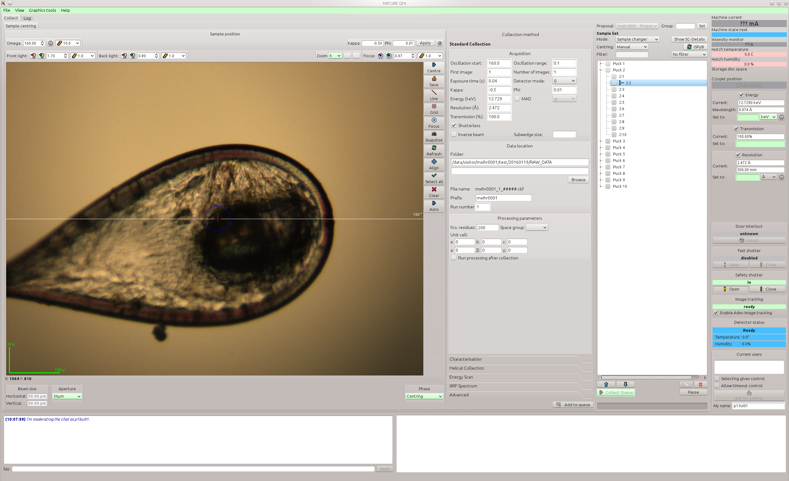

Qt version user manual
#############################

Please be aware that the GUI layout described in this manual could differ 
from the actual gui layout in the beamline.

***************************
1. Graphical User Interface
***************************

In this section of the manual, gui layout is described. MXCuBE is organized in tabs
and each tab represents certain function. After launching MXCuBE, main screen will be
opened.

1.1. Main screen
================

:ref:`Main screen <figure_main_screen>` is divided into definite areas:

1. Login and proposal
2. Sample list and data collection queue
3. Sample video and centring 
4. Collection methods
5. Machine status
6. Log and chat

.. _figure_main_screen:

   Main screen.

Further each area is described in details.

1.2. Login and proposal
-----------------------

Area is used to identify user and link proposal from ISPyB with MXCuBE. Depending on a 
sychrotron, two ways how a user is authenticated are possible:

1. User is authenticated automaticaly based on a system user name. User does not have to enter user name. MXCuBE retrieves all proposals associated with current user and populates combobox. Proposal that have a session on the current day is selected as active proposal.
2. User is authenticated by proposal name and password.

If no proposal is found then error message is displayed and all informations is
not stored in ISPyB.

1.3. Sample list and data collection queue
------------------------------------------

1.4. Sample video and centring
------------------------------

1.5. Collection methods
-----------------------

1.5.1. Standart collection
^^^^^^^^^^^^^^^^^^^^^^^^^^

1.5.2. Characterisation
^^^^^^^^^^^^^^^^^^^^^^^

1.5.3. Helical collection
^^^^^^^^^^^^^^^^^^^^^^^^^

1.5.4. Energy scan
^^^^^^^^^^^^^^^^^^

1.5.5. XRF spectrum
^^^^^^^^^^^^^^^^^^^

1.5.6. Advanced
^^^^^^^^^^^^^^^

1.6. Detailed information tabs
------------------------------

1.7. Machine status
-------------------

1.8. Log and chat
-----------------

***********
2. How to's
***********

2.1. Use the basics of MXCuBE
=============================

2.2. Work with sample tree
==========================

2.3. Link your samples with ISPyB
=================================

2.4. Select a sample from sample changer and mount it
=====================================================

2.5. Create a new collection
============================

2.5.1. Center your sample and save a centring position
------------------------------------------------------

2.5.2. Create a task by using created centring position
-------------------------------------------------------

2.5.3. Perform a helical data collection
----------------------------------------

2.5.4. Perform characterisation
-------------------------------

2.5.5. Measure an energy scan (MAD/SAD)
---------------------------------------

2.5.6. Measure a X-ray fluorescence (XRF) spectrum
--------------------------------------------------

2.5.7. Perform mesh scan and other advanced methods
---------------------------------------------------

2.5.8. Create a task by using several centring positions
--------------------------------------------------------

2.5.9. Create several tasks on several centring positions
---------------------------------------------------------

2.5.10. Create tasks on multiple samples
----------------------------------------

2.6. Measure distance, angle or area
====================================

2.7. Visualy re-orient crystal
==============================
