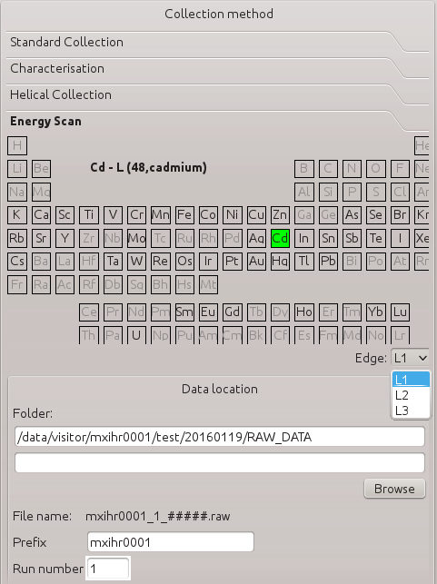
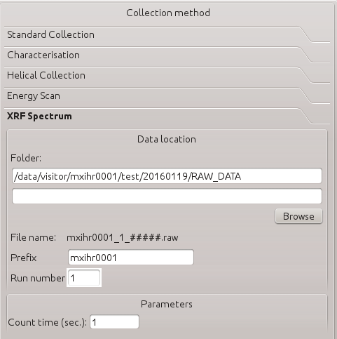

MXCuBE user manual
#############################

This manual describes :ref:`graphical user interface <gui>` of MXCuBE
and basic operations how to run a necessary data collection (see :ref:`How to's section <howto>`).
GUI layout described in this manual could differ from the actual MXCuBE GUI at the beamline.

***************************
Graphical User Interface
***************************

In this section the graphical user interface is described.
:ref:`Main screen <figure_main_screen>` of MXCuBE is divided into areas:

* :ref:`Login and proposal <login_and_proposal>`
* :ref:`Sample tree <sample_tree>`
* :ref:`Sample video and centring <sample_video_centring>`
* :ref:`Beam defining tools <beam_definition>`
* :ref:`Collection methods <collection_methods>`
* :ref:`Machine status <machine_status>`
* :ref:`Logging and chat <logging_chat>`

.. _figure_main_screen:

.. figure:: images/manual_main_screen.png
   :alt: manual_main_screen

.. _login_and_proposal:

Login and proposal
=======================

Area is used to identify user and link ISPyB with MXCuBE. 
Depending on the beamline one of two authentication methods is possible:

1. User is authenticated automaticaly based on the computer login name.

.. figure:: images/manual_ispyb_proposal.png
   :scale: 70 %
   :alt: manual_ispyb_proposal

2. User manually has to enter user name and password.

After a **successfull login**:

* All proposals with the current user are retrieved and combobox with proposals is populated.
* Proposal having a session on the current day is selected as active proposal. If no proposal has a scheduled session then the newest proposal is selected and a 24h session is created.
* If several proposals exist, then user can select necessary proposal from proposol combobox.
* Data collection methods and sample tree becomes available.
* The path where user's data are recorded will apper in the collection method area.

.. warning::
   If **no proposal** is found then the information about collections is not stored in ISPyB.

.. figure:: images/no_proposal.png
   :scale: 70 %
   :alt: manual_ispyb_proposal

.. _sample_tree:

Sample tree
===========

Sample tree is used to mount/dismount samples on the goniometer and schedule, executed necessary data collections.

Basic operations with the sample tree
^^^^^^^^^^^^^^^^^^^^^^^^^^^^^^^^^^^^^

**1. Sample mounting mode**

.. figure:: images/manual_sample_mount_mode.png
   :scale: 80 %
   :alt: manual_sample_mount_mode

* *Manually mounted*. In the tree a single sample item is display and user has to manualy mount a sample on the goniometer. Use this mode if sample changer is not used.
* *Sample changer*. Sample tree is populated with Pucks and Samples according to the content of the sample changer.
* *Plate*. Sample tree is populated with Rows and Cells corresponding to the plate.
* *Mounted sample*. If the sample changer of plate manipulator is used and a sample is mounted then sample tree is filtered and just the mounted sample is displayed.

.. image:: images/manual_sample_tree_manual.png
    :width: 15 %
    :alt: Sample tree in the Manually mounted mode
.. image:: images/manual_sample_tree_sc.png
    :width: 15 %
    :alt: Sample tree in the Sample changer mode

.. note::
   Based on the beamline configuration sample changer and plate availability may differ.

**2. Sample centering mode**

Sample centring mode defines the type of centring that will be requested before executing a collection without a pre-centered position.

.. figure:: images/manual_sample_centring_mode.png
   :scale: 80 %
   :alt: manual_sample_centring_mode

* *Manual 3-click*: manual 3 click centring procedure.
* *Optical semi automatic*: auto-loop visual centring requesting user validation (most common option).
* *Optical fully automatic*: auto-loop visual centring without user validation (for automatic pipelines).
* *Automatic X-ray*: method performs a mesh scan and a line scan to locate a crystal.

**3. Sample**

Combobox allows to link a sample from ISPyB to the manually mounted sample. Combobox becomes active if the manually mode is selected and synchronization with ISPyB has been done (button ISPyB pressed).

**4. Filter**

Filter sample tree based on the selected filter:

* *No filter*: remove selected filter.
* *Star*: display entries with added star (right click on the entry and click "Add star").
* *Sample name*
* *Protein name*
* *Basket index*
* *Executed*
* *Not executed*
* *OSC*
* *Helical*
* *Characterisation*
* *Energy scan*
* *XRF spectrum*
* *Advanced*

**5. Show SC-Details details**

Opens a new tab with detailed information about the sample changer.

.. figure:: images/manual_sc_brick.png
   :scale: 50 %
   :alt: manual_sc_brick

**6. ISPyB**

Link samples with ISPyB.

Detailed information about the sample tree
^^^^^^^^^^^^^^^^^^^^^^^^^^^^^^^^^^^^^^^^^^^^^^^^^

Sample tree describe user created data collections sequences.
After starting MXCuBE tree is populated with Pucks/Rows and sample(s) corresponing to the content of sample changer or plate.
Data collection items are added to the tree by selecting necessary sample, choosing collection method and adding method to the tree (see :ref:`collection methods <collection_methods>` and :ref:`How to create a new data collection<create_new_collection>` sections).
Several actions are available by right clicking on the tree item:

**Puck or Row**:

* *Rename* item
* *Add star* for filtering
* *Paste* collection item
* *Add collection from file*

**Sample**:

* *Rename* item
* *Add star* for filtering
* *Paste* collection item
* *Mount* sample on the goniometer
* *Dismount* sample if sample is mounted on the goniometer
* *Add diffraction plan from ISPyB*
* *Add collection from file*
* *Details*

**Data collection**:

* *Rename item*
* *Add star*
* *Cut*
* *Copy*
* *Paste*
* *Save in file*
* *Load from file*
* *Add collection from file*
* *Remove*
* *Details*

Tick the box corresponding to:

* a puck, to add a collection item to all corresponding samples or to collect every tasks for this puck when clicking on “Collect queue”.
* a sample item, to add a collection item or to collect every tasks for this sample when clicking on “Collect queue”.
* a particular task, to collect only this task when clicking on “collect queue”.

.. figure:: images/manual_sample_tree_ispyb.png
   :scale: 80 %
   :alt: manual_sample_tree_ispyb

Tree items are painted based on the following color scheme:

* no color: not yet performed and not selected.
* blue: item is selected.
* violet: sample mounted on the goniostat.
* green: done
* red: failed
* yellow: done but no result

.. figure:: images/manual_sample_tree_colors.png
   :scale: 80 %
   :alt: manual_sample_tree_colors

.. hint::
   * Moving cursor over a data collection entry opens a tooltip with collection parameters.
   * Double click on the tree item opens a tab with details (if not performed yet) or results (if performed).

.. _sample_video_centring:

Sample video and centring
==============================

A life view of the sample is the center element of the MXCuBE GUI:

* At the bottom left corner a scale is displayed.
* White line correspons to the osciallation axis (current angle of the axis is displayed next to the line)
* The blue circle reflects the beam size defined by an aperture and the rectangle shape describes the beam defined by slits.

Sample positioning tools
^^^^^^^^^^^^^^^^^^^^^^^^^^^^^^^

Double click on the sample moves the sample to the beam. Additionaly to define a new sample position several widgets to change osciallation angle, kappa, phi angles are available. Motor control widget contains:
 
1. Motor name.
2. Current position of the motor. To change it write a new value and press Enter.
3. Move the current value up or down by a step defined in the step combobox.
4. Stop the movement.
5. Step definition combobox.

.. figure:: images/manual_motor_control.png
   :scale: 80 %
   :alt: manual_motor_control

Additional widgets to control **Zoom**, **Focus**, **Holder lenght**, **Front** and **Back light** are available.

.. figure:: images/manual_sample_control.png
   :alt: manual_sample_control.png

.. hint::
   * Use mouse wheel to rotate the sample.
   * Double click on the crystal to move it into the beam.

Graphical tools
^^^^^^^^^^^^^^^

Right next to the sample life view graphical tools are available:

+---------------------------------------+-------------------------------------+
| .. image:: images/button_center.png   | Three click centering of the sample |
|    :scale: 80%                        |                                     |
+---------------------------------------+-------------------------------------+
| .. image:: images/button_save.png     | Save current centred position       |
|    :scale: 80%                        |                                     |
+---------------------------------------+-------------------------------------+
| .. image:: images/button_line.png     | Create a helical line               |
|    :scale: 80%                        |                                     |
+---------------------------------------+-------------------------------------+
| .. image:: images/button_grid.png     | Draw a 2D mesh                      |
|    :scale: 80%                        |                                     |
+---------------------------------------+-------------------------------------+
| .. image:: images/button_focus.png    | Autofocus                           |
|    :scale: 80%                        |                                     |
+---------------------------------------+-------------------------------------+
| .. image:: images/button_snapshot.png | Take a snapshot                     |
|    :scale: 80%                        |                                     |
+---------------------------------------+-------------------------------------+
| .. image:: images/button_align.png    | Visual kappa realign                |
|    :scale: 80%                        |                                     |
+---------------------------------------+-------------------------------------+
| .. image:: images/button_selectall.png| Select all centring points          |
|    :scale: 80%                        |                                     |
+---------------------------------------+-------------------------------------+
| .. image:: images/button_clear.png    | Delete all graphical objects        |
|    :scale: 80%                        |                                     |
+---------------------------------------+-------------------------------------+
| .. image:: images/button_auto.png     | Auto centering of the sample        |
|    :scale: 80%                        |                                     |
+---------------------------------------+-------------------------------------+

Right click on the screen opens a popup with the graphical tools.

.. figure:: images/manual_left_click2.png
   :scale: 80 %
   :alt: manual_left_click2

.. hint::
   For more information on how to perform a visual realign (see :ref:`How to do visual reorientation <visual_reorient>`)

.. _beam_definition:

Beam defining tools
===================

Beam defining tools allows to change the beam conditions. From the left side to right following widgets are available:

* Beam size. Displays beam size at the sample.
* Beam focusing. Controls beamline focusing mode (focused or unfocused beam).
* CRL. Allows to define the setting of comound refractive lenses (CRLs). Combobox sets CRLs in *Manual* and *Automatic* mode or removes all lenses (*Out*). Button *Set* sets the lenses according to the current energy. Double click on the table cell sets in or out individual lens. Arrows up and down changes the setting of lenses. 
* Slits. Allows to define beam with slits.
* Aperture.
* Phase. Changes the phase of the diffractometer.

.. hint::
   To match the beam size to the crystal use graphical tool *Define beam size with slits* available in menu after right click on the screen.

.. _collection_methods:

Collection methods
=======================

1. Collection method option (NB : For more information on the different options please refer to the “How to” section
).
2. Data location is a comman part for all collection methods:

* Folder/Subdirectories below the RAW_DATA directory of your session. Automatically filled with "Acronym-samplename" if a sample list from ISPyB is synchronised.
* Prefix of image: Automatically filled with “ACRONYM-samplename” if a sample list from ISPyB is synchronised

* Run number is incremented for each experiment from the same method.

3. For each collection method, once you have adjusted the parameters, "Add to queue" will add the collection to the selected sample(s) and display it in the queue of the sample list area. 

Standart collection
^^^^^^^^^^^^^^^^^^^^^^^^^^

Use the standard collection when you know your diffraction plan.

.. figure:: images/manual_create_dc_parameters.png
   :scale: 60 %
   :alt: create_dc

1. Fill in the data collection parameters
2. Tick if you want to start the oscillation at a particula angle (default is current angle).
3. If kappa and phi angles are adjusted then a new centring task with selected kappa and phi will be added. See (How to's section for more information).
4. Tick if you want to use peak, inflection point and an energy from an energy scan.
5. Tick to collect in a shutterless mode (ticked by default).
6. If necessary adjust processing parameters and tick "Run autoprocessing" 
(not ticked by default) to run automatic EDNA processing.

Characterisation
^^^^^^^^^^^^^^^^^^^^^^^

Use the characterisation option when you want to automatically obtain a diffraction plan from EDNA.

.. figure:: images/manual_create_char_parameters.png
   :scale: 60 %
   :alt: create_char

1. Choose the number of images taken to characterise the crystal (1, 2 or 4).
2. Tick if you want to start the oscillation at a particular angle.
3. To do a data collection with the same parameters but at different kappa angles please see the “how to” section.
4. Select the complexity of the diffraction plan you accept (1 or multiple subwedges).
5. Tick if you want that EDNA takes the radiation damage into account (ticked by default).
6. Tick if you want a diffraction plan for anomalous phasing.
7. Force EDNA to use the space group you provide.
8. Provide vertical dimensions of your crystal (2 measures 90° apart, see “How to: measure a crystal” section). It will be used by RADDOSE for dose absorption prediction. 
9. Untick "Characterisation" group box to take reference images but not execute EDNA characterisation

Helical collection
^^^^^^^^^^^^^^^^^^^^^^^^^

Use the helical collection to collect along a specified line to minimize radiation damage

.. figure:: images/manual_create_helical.png
   :scale: 60 %
   :alt: create_helical

1. Add line(s) to define path of the helical collection (see how to section)
2. Fill in the different parameters from your diffraction plan
3. Tick if you want to start the oscillation at a particular angle
4. Tick if you want to perform MAD experiment
5. Tick to collect in shutterless mode (ticked by default)
6. Fill in if you want to force a particular space group in the EDNA auto-processing.

Energy scan
^^^^^^^^^^^^^^^^^^

Perform an energy scan if you expect your crystal to contain a particular element that might be excited (Selenium, Iron, Magnesium...)

1 Select an element in the periodic table and click on “Add to queue”.

XRF spectrum
^^^^^^^^^^^^^^^^^^^

1 Enter the count time and add to queue.
2 and 2’ Tick the XRF spectrum parameters box and choose where to save your data (NB : to know more about XRF spectrum go to “how to” section).

Advanced
^^^^^^^^^^^^^^^

“Advanced” displays collection types made of task and decision series. Example: “X-ray centering” will center the best part of your crystal in the beam by doing a MESH scan followed by a line scan at 90° and will analyse the diffraction images
For more information on the different advanced options please refer to “How to” section

.. figure:: images/manual_create_advanced.png
   :scale: 60 %
   :alt: create_advanced

.. _machine_status:

Machine status
===================

1. Machine current and Synchrotron filling mode.
2. Photon flux at sample position (check if available).
3. Beamline energy. To adjust on tunable beamline: enter a value in the green box and press enter.
4. Maximum resolution recorded at the edge of the detector. To adjust: enter a value in the green box and press enter.
5. Beam transmission. To adjust: enter a value in the green box and press enter.
6. Unlock the hutch doors.
7. Open/ Close the safety shutter. Not accessible when the experimental hutch door is open. Open safety shutter when the hutch doors are interlocked.
8. Open/ Close the Fast shutter.
9. Information about detector: temperature, humidity and status.
10. Remote access menu (local contact only).

.. figure:: images/manual_mach_info.png
   :scale: 30 %
   :alt: mach_info

.. _logging_chat:

Log and chat
=================

Dialogue area : here MXCuBE indicates what it is doing or its status. It will flashes orange when a new information is displayed or when user input is required.

.. _howto:

Beamline test
=================

Toolbar
================

***********
How to's
***********

Use the basics of MXCuBE
=============================

**In basic mode**:

1. Log-in in MXCuBE.
2. Select a sample.
3. Center it and save.
4. Select a collection method and add to queue.
5. Collect queue.

**In pipeline mode (semi or fully automatic)**:

1. Log-in MXCuBE.
2. Select the semi or fully automatic centring mode.
3. Select a list of sample: Press Ctrl key while clicking on sample name or Press shift key and select 1st and last sample name or Select the first sample name and drag to the last sample name.
4. Select a collection method, adjust parameters as required and add to queue.
5. Collect queue.

Link your samples with ISPyB
=================================

Why linking my samples from ISPyB to MXCuBE ?

This action will allow you to view your samples (described in IPSYB) in the MXCuBE sample list and link your samples to the data collections.
Facilitate your experiment (image prefix and directories are automatically filled in MXCuBE).

**In ISPyB**:

* Easy grouping of your data collections per sample.
* Easy searches by sample and/or by protein acronym to list all experiments performed over the various sessions.

1. Prepare experiment in ISPYB (as described in ISPYB manual).
2. Log-in in MXCuBE – Choose sample changer mode.
3. Synchronize with ISPyB.
4. View your sample list -> “1:1” becomes “1:1- Acronyme-sample1”.

Select a sample from sample changer and mount it
=====================================================

1. Click on a sample to select it. The sample name will be highlighted in black
2. Right click to access the sample changer mounting menu and click on mount
3. To un-mount manually a mounted sample, right click on the sample name to access the sample changer mounting menu then select un-mount

Create a new collection
============================

.. _create_new_collection:

Center your sample and save a centring position
^^^^^^^^^^^^^^^^^^^^^^^^^^^^^^^^^^^^^^^^^^^^^^^^^^^^^^

1. Dialogue box : After auto loop-centring is finished you can save the current position or re-center.
2. To re-center, click 3 times on the point you want to center in the beam (red cross).
3. Save this position (mandatory to start a collection), a yellow circle with a number appears .
4. Once selected, the yellow crossed circle becomes bold green.

Create a task by using created centring position
^^^^^^^^^^^^^^^^^^^^^^^^^^^^^^^^^^^^^^^^^^^^^^^^^^^^^^^

Having a sample selected and a position saved and selected for this sample (see previous page):

1. Fill in the parameters and Add to queue NB : If you did not center your sample or select the centered position before starting your collection, MXCuBE will automatically add a centring task to the queue.
2. The corresponding collection will be added to the queue on the sample list -> Click on “Collect queue” NB: In the queue, each task will be associated to the corresponding number of the selected position.
3. A confirmation message will appear -> Click continue. 
4. You can stop, pause or continue the process at any time (effective at the end of the current task).
5. When finished, sample list will become green (if successful), yellow or red. If results are expected (EDNA characterisation...) double click on the result line to view them.

Perform same collection method on several positions of one sample
^^^^^^^^^^^^^^^^^^^^^^^^^^^^^^^^^^^^^^^^^^^^^^^^^^^^^^^^^^^^^^^^^^^^^^^^

Follow this process to perform the same action on various parts of the same sample. 
Example: EDNA characterisation

1. On the mounted sample centre and save several positions (all numbered and yellow except the last one, bold and green).
2. Select all : press ctrl key + select each yellow ring on sample view.
3. Select a task to add (here EDNA characterisation) and press “Add to queue”.
4. Collect queue: in that particular case, an EDNA characterisation is performed on each. saved position and a diffraction plan is proposed for each position.

NB: It is possible at this level to rank the positions automatically within ISPyB (see ISPyB
manual) and to select the crystal part which is of best quality.

Perform same collection method on multiple samples
^^^^^^^^^^^^^^^^^^^^^^^^^^^^^^^^^^^^^^^^^^^^^^^^^^^^^^^^^

Follow this process to perform the same action(s) on each sample of a selected pool.
Example: EDNA characterisation on each sample to select the best suitable crystal of the pool.

1. Select the samples of interest in the sample list:

* by selecting the 1st one of the series and pressing shift key while selecting the last one.
* or by selecting all samples of interest one by one while pressing the Ctrl key.

2. Above sample list, select fully automatic or semi-automatic (Centring type).
3. Select a task to add (here EDNA characterisation...) and press “Add to queue”.
4. If semi-automatic centring was selected, a centring step is added to the queue. For each sample, press continue to accept the automatic centring or re-center. This is not the case in fully automatic mode.
5. “Collect queue” will collect all ticked tasks from the queue (untick a task if you do not want it to be performed straightaway).

Perform a helical data collection
^^^^^^^^^^^^^^^^^^^^^^^^^^^^^^^^^^^^^^^^

Use the helical data collection to collect along a specified axis along the spindle axis:

1. Save two positions at the two extremities of the axis on which  you want to perform helical data collection and select them (ctrl + click).
2. And Add a guiding line for the helical collection.
3. Fill in the parameters.
4. Add to queue.
5. Check that the corresponding box is ticked and collect Queue.

NB: The saved positions are numbered and the helical collection will start at the first selected point (here “10”).

Define a grid for a mesh scan or a X-ray centring
^^^^^^^^^^^^^^^^^^^^^^^^^^^^^^^^^^^^^^^^^^^^^^^^^^^^^^^^

1. Click on this icon to start grid drawing.
2. To set the grid: click on the first corner (A) then drag until you obtain the desired shape (B).
3. During and after the drawing total number of scan lines and number of images per line are displayed on the top right corner.

* Horizontal and vertical spacing in microns defines distance between collection frames.
* If beam size is more than 20 pixels then grid is displayed with beam shapes. Otherwise rectange defines the scan area.
* If the grid is not parallel to the screen, then a projection of a grid is displayed.
* Use slider to change the transperancy of the grid. 

Perform a mesh scan
^^^^^^^^^^^^^^^^^^^^^^^^^^

1. Create a grid as described in 2.5.4.
2. Select the MeshScan method in “Collection method/Advanced” tab and press "Add to queue"
3. Press "Collect queue

NB: You can draw several grid to work on different part of your crystal.

Perform a X-ray centring
^^^^^^^^^^^^^^^^^^^^^^^^^^^^^^^

Measure an energy scan (MAD/SAD)
^^^^^^^^^^^^^^^^^^^^^^^^^^^^^^^^^^^^^^^

Measure a X-ray fluorescence (XRF) spectrum
^^^^^^^^^^^^^^^^^^^^^^^^^^^^^^^^^^^^^^^^^^^^^^^^^^

.. _visual_reorient:
Visualy re-orient crystal
==============================

Align beam
================

Check processing results
=========================

1. Right click on the data collection entry and select "View in ISPyB".

*******************
Trouble shooting
*******************

.. note::
   Collection method is not available (all options are light grey): No sample is selected. 

* Select one or several samples from the sample list.

.. note::
    MXCuBE does not respond anymore.

* Start a new MXCuBE instance by clicking on the MXCuBE icon. Previous instnce will be terminated and a new one will be started.

.. note::
   My sample is not mounted/unmounted when I click on mount/unmount.

* Check sample changer status through a VNC to the sample changer interface. 
* Check that nothing is blocked on the path of the sample or underneath the arm of the sample changer.
* Manually turn the pin of your sample on the magnet by 20 °.
* Try to mount/unmount your sample again.
* After 2-3 times call your local contact.

.. note::
   The queue is interrupted because the sample changer failed to upload or download a sample.

* Select the tasks by ticking them in the queue after having fixed the problem and Collect queue again.

.. note::
   I added to the queue a wrong collection method.

* Tick the box corresponding to this collection and remove it by clicking on the red bin.

.. note::
   I started a wrong collection method.

* Click on the stop button (replacing the “Collect queue” button) and trash the method by clicking on the red bin.

.. note::
   I would like to change few parameters of a collection method already added to the queue.

* Click on the line corresponding to this method in the queue. This will open tab where you can edit parameters.

.. note::
   I added a collection entry, but the Collect button is disabled.

* Check if the safety shutter is opened.
* Check if there is no error from PPU server.
* Make sure data collection item, group and sample is ticked.
